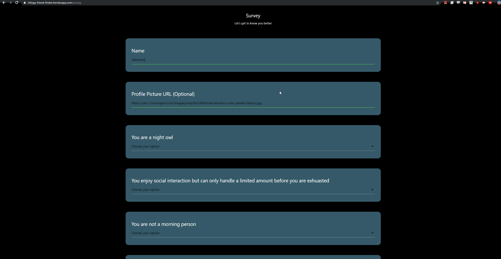

# friendFinder
Node and Express powered online dating (friending?) application

### Dependencies:
    "express": "^4.17.1",
    "express-handlebars": "^3.1.0",
    "path": "^0.12.7"

TODO:

### What Is It?

FriendFinder is an online dating or friending service that matches users based off of the results of a survey that they fill out. Upon submission the application will notify the user with the "friend" in the database that is the best match.

Matching is determined by finding the record with the lowest net difference in survey question answers (each question is answered with a range from 1-10).

